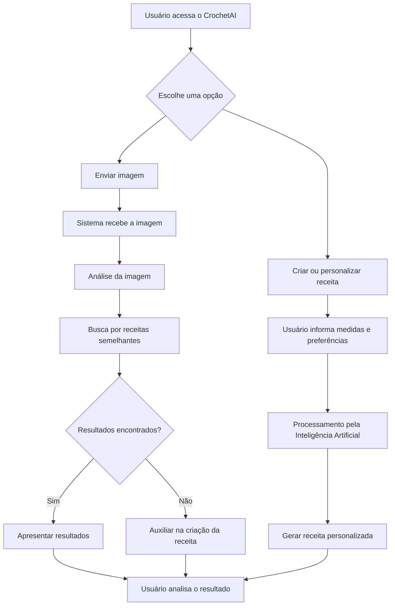
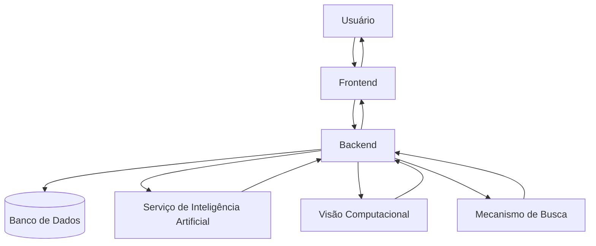
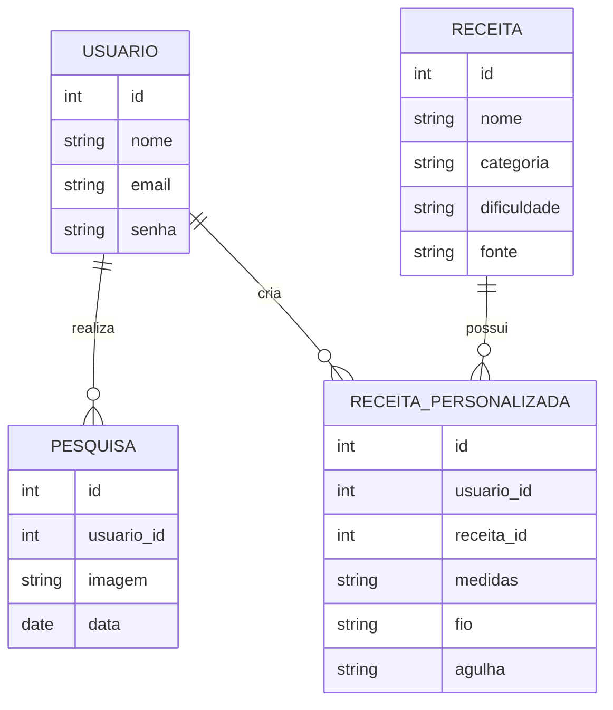
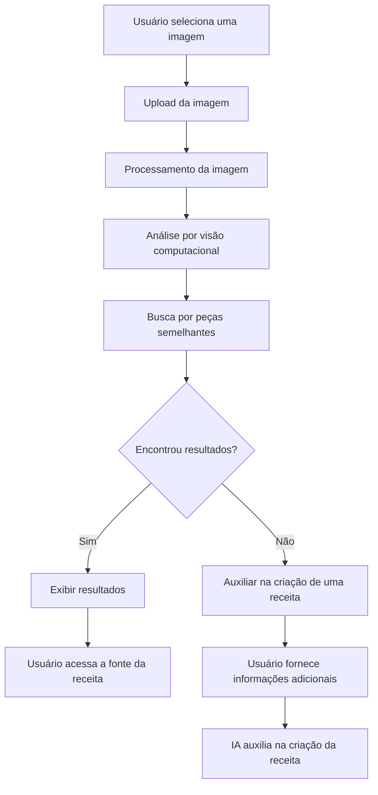
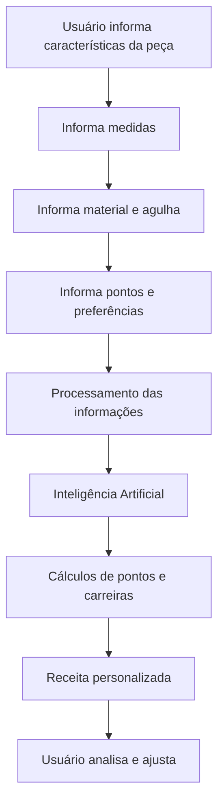

# Arquitetura e Modelagem — LNCrochetAI

## 1. Introdução

Este documento apresenta a modelagem inicial da plataforma CrochetAI, contemplando o fluxo principal do sistema, a arquitetura proposta, o modelo inicial de dados e os protótipos das principais interfaces da aplicação.

## 2. Fluxograma geral do sistema

O fluxo geral representa as principais etapas realizadas pelo usuário desde o acesso à plataforma até a obtenção de uma receita ou resultado de busca.

## 3. Arquitetura do sistema

A arquitetura proposta apresenta os principais componentes da plataforma e a comunicação entre eles. O usuário interage com a interface da aplicação, que se comunica com o backend responsável pelo processamento das informações e integração com os demais serviços.

## 4. Modelo de dados

O modelo de dados representa as principais informações que deverão ser armazenadas pelo sistema e seus relacionamentos.

## 5. Fluxo da busca por imagem

A busca por imagem representa uma das principais funcionalidades do CrochetAI. O usuário envia uma fotografia de uma peça, que será analisada pelo sistema para auxiliar na localização de peças ou receitas semelhantes.

## 6. Fluxo de criação e personalização de receitas

O usuário poderá fornecer informações sobre a peça desejada, suas medidas e preferências. Essas informações serão utilizadas para auxiliar na elaboração ou adaptação de uma receita.

## 7. Protótipos de interface

Os protótipos iniciais da plataforma serão desenvolvidos para representar as principais telas e interações previstas para o sistema.

As telas previstas são:

- Página inicial;
- Busca por imagem;
- Resultados da busca;
- Criação de receita;
- Personalização de receita.

### Página inicial

A página inicial deverá apresentar as principais funcionalidades da plataforma e permitir que o usuário escolha entre buscar uma receita por imagem ou criar e personalizar uma receita.

### Busca por imagem

A tela deverá permitir que o usuário envie uma imagem da peça de crochê que deseja pesquisar.

### Resultados

A tela deverá apresentar os resultados encontrados pelo sistema, incluindo peças ou receitas semelhantes e suas respectivas fontes.

### Criação de receita

A tela deverá permitir que o usuário informe características da peça, como tamanho, medidas, fio, agulha e ponto.

### Personalização

A tela deverá permitir que o usuário adapte uma receita de acordo com suas medidas e preferências.

## 8. Tecnologias previstas

As tecnologias inicialmente previstas para o desenvolvimento da plataforma são:

- HTML5;
- CSS3;
- JavaScript;
- Node.js;
- Banco de dados;
- APIs de Inteligência Artificial;
- Tecnologias de visão computacional;
- Git e GitHub.

As tecnologias poderão ser ajustadas durante o desenvolvimento do projeto.
